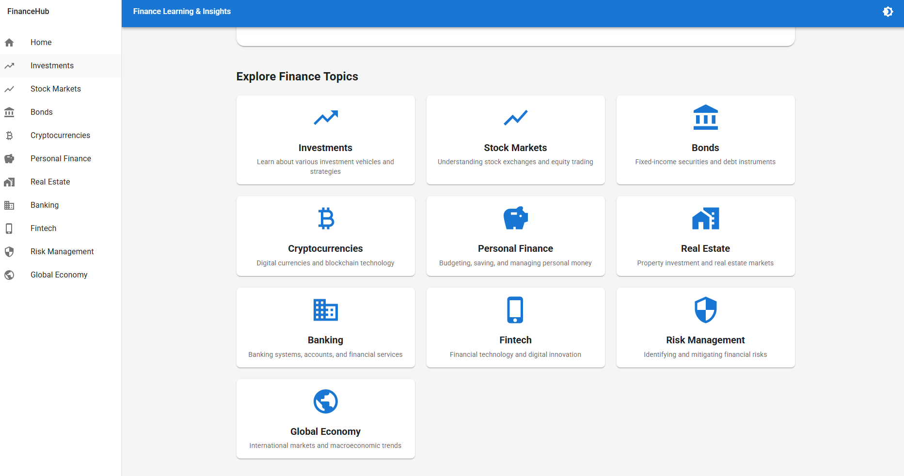

# FinanceHub - Finance Learning & Insights Web Application



A comprehensive full-stack web application for financial education and real-time market insights. Built with **Go (Golang)** backend and **Material UI + Vite + TypeScript** frontend.

## 📥 Download

### Latest Release

Download the latest version of FinanceHub for Windows:

**[Download FinanceHub v1.0.0](https://github.com/reyisjones/FinanceHub/releases/latest)**

#### System Requirements
- **OS**: Windows 10/11 (64-bit)
- **Runtime**: WebView2 (pre-installed on Windows 10/11)
- **Disk Space**: ~20 MB

#### Installation
1. Download `FinanceHub-v1.0.0-windows-amd64.exe` from the [Releases page](https://github.com/reyisjones/FinanceHub/releases)
2. Run the installer and follow the setup wizard
3. Launch FinanceHub from your Start Menu or Desktop shortcut

#### What's Included
- ✅ Desktop application with native Windows integration
- ✅ All 10 finance learning modules
- ✅ Real-time market data and charts
- ✅ Dark/Light mode support
- ✅ Offline-capable interface

### Release Notes

See the [Changelog](https://github.com/reyisjones/FinanceHub/releases) for version history and updates.

## 🌟 Features

- **📚 10 Key Finance Topics**: Comprehensive educational content covering:
  - Investments
  - Stock Markets
  - Bonds
  - Cryptocurrencies
  - Personal Finance
  - Real Estate
  - Banking
  - Fintech
  - Risk Management
  - Global Economy

- **📊 Real-Time Market Data**: 
  - Live stock quotes and historical charts
  - Top 10 cryptocurrencies by market cap
  - Currency exchange rates
  - Interactive data visualizations

- **🎨 Modern UI/UX**:
  - Material UI design system
  - Dark/Light mode toggle
  - Responsive design for all devices
  - Clean sidebar navigation

- **🚀 High Performance**:
  - Go backend for fast API responses
  - Vite for lightning-fast frontend development
  - TypeScript for type safety

## 📁 Project Structure

```
FinanceHub/
├── backend/                 # Go backend
│   ├── handlers/           # API route handlers
│   ├── models/             # Data models
│   ├── services/           # External API services
│   ├── main.go             # Application entry point
│   ├── go.mod              # Go module dependencies
│   └── .env.example        # Environment variables template
│
├── frontend/               # React + TypeScript frontend
│   ├── src/
│   │   ├── components/    # Reusable UI components
│   │   ├── pages/         # Page components (11 pages)
│   │   ├── services/      # API client
│   │   ├── types/         # TypeScript types
│   │   ├── wailsjs/       # Auto-generated Wails bindings
│   │   ├── App.tsx        # Main app component
│   │   ├── main.tsx       # Application entry
│   │   └── theme.ts       # Material UI theme
│   ├── package.json       # npm dependencies
│   ├── vite.config.ts     # Vite configuration
│   └── tsconfig.json      # TypeScript configuration
│
├── models/                # Go data models (shared)
├── services/              # Go services (shared)
├── handlers/              # API route handlers
├── app.go                 # Wails Go bindings
├── main.go                # Wails desktop entry point
├── wails.json             # Wails configuration
├── build-wails.bat        # Build automation script
└── README.md              # This file
```

## 🛠️ Technology Stack

### Desktop Application (Wails)
- **Wails v2.10.2**: Go + Web frontend framework for desktop apps
- **WebView2**: Native Windows webview integration
- **Go 1.23**: High-performance backend

### Backend
- **Go 1.21+**: High-performance backend language
- **Gin**: Web framework for routing and middleware
- **CORS**: Cross-origin resource sharing
- **godotenv**: Environment variable management

### Frontend
- **React 18**: UI library
- **TypeScript**: Type-safe JavaScript
- **Material UI (MUI)**: Component library
- **Vite**: Build tool and dev server
- **React Router**: Client-side routing
- **Recharts**: Data visualization
- **Axios**: HTTP client

### External APIs
- **Alpha Vantage**: Stock market data and currency rates
- **CoinGecko**: Cryptocurrency prices and market data

## 🚀 Getting Started

FinanceHub can be run in two modes:
1. **Desktop Application** (Wails) - Recommended for end users
2. **Web Application** (Separate frontend/backend) - For development

### Desktop Application Setup (Wails)

**Prerequisites:**
- Go 1.23+ ([Download](https://golang.org/dl/))
- Node.js 18+ ([Download](https://nodejs.org/))
- Wails CLI (`go install github.com/wailsapp/wails/v2/cmd/wails@latest`)
- WebView2 Runtime (Windows 10/11 usually has this)

**Quick Build & Run:**
```bash
# Build the desktop application
wails build -clean

# Run the executable
./build/bin/FinanceHub.exe
```

**Alternative - Using Scripts:**
```bash
# Build production executable
build-wails.bat

# Run the app
./build/bin/FinanceHub.exe
```

**Note:** `wails dev` may hang on some systems. Use `wails build -debug` instead for development builds.

See [docs/WAILS_SETUP.md](docs/WAILS_SETUP.md) for complete desktop application documentation.

### Web Application Setup (Development)

**Quick Start:**
```bash
# Automated setup and launch (recommended)
./setup.bat
./start-dev.bat
```

This will:
- Install all dependencies
- Create `.env` file
- Start backend (port 8080) and frontend (port 5173)

### Manual Prerequisites

- **Go 1.21 or higher**: [Download Go](https://golang.org/dl/)
- **Node.js 18+ and npm**: [Download Node.js](https://nodejs.org/)
- **Alpha Vantage API Key**: [Get Free API Key](https://www.alphavantage.co/support/#api-key)

### Backend Setup

1. **Navigate to backend directory**:
   ```bash
   cd backend
   ```

2. **Create environment file**:
   ```bash
   cp .env.example .env
   ```

3. **Configure API keys** in `.env`:
   ```env
   PORT=8080
   ALPHA_VANTAGE_API_KEY=your_actual_api_key_here
   ```

4. **Install Go dependencies**:
   ```bash
   go mod download
   ```

5. **Run the backend API server**:
   ```bash
   cd backend
   go run main.go
   ```

   The API server will start on `http://localhost:8080`

   **Note:** When running as a desktop app with Wails, you don't need to start the backend separately.

### Frontend Setup

1. **Navigate to frontend directory**:
   ```bash
   cd frontend
   ```

2. **Install npm dependencies**:
   ```bash
   npm install
   ```

3. **Start the development server**:
   ```bash
   npm run dev
   ```

   The application will open at `http://localhost:5173`

### 🎯 Quick Command Reference

**Desktop Mode:**
```bash
wails build -clean              # Build production executable
wails build -debug              # Build with dev tools enabled
./build/bin/FinanceHub.exe      # Run the desktop app
```

**Web Development Mode:**
```bash
./setup.bat                     # First-time setup
./start-dev.bat                 # Start backend + frontend
```

## 🔑 API Key Configuration

### Alpha Vantage API Key

1. Visit [Alpha Vantage](https://www.alphavantage.co/support/#api-key)
2. Enter your email to receive a free API key
3. Copy the API key
4. Add it to `backend/.env` file:
   ```
   ALPHA_VANTAGE_API_KEY=YOUR_KEY_HERE
   ```

**Note**: Free tier provides 25 API requests per day. For production use, consider upgrading.

### CoinGecko API

CoinGecko's public API is used for cryptocurrency data and doesn't require an API key for basic usage.

## 📡 API Endpoints & Wails Bindings

### Web Mode - REST API Endpoints

**Topics:**
- `GET /api/topics` - Get all finance topics
- `GET /api/topics/:id` - Get specific topic by ID

**Stocks:**
- `GET /api/stocks/:symbol` - Get real-time stock quote
- `GET /api/stocks/:symbol/timeseries` - Get historical stock data (30 days)

**Cryptocurrencies:**
- `GET /api/crypto/top` - Get top 10 cryptocurrencies
- `GET /api/crypto/:id` - Get specific cryptocurrency price

**Currency Exchange:**
- `GET /api/currency/:from/:to` - Get exchange rate between currencies

**Health Check:**
- `GET /api/health` - API health status

### Desktop Mode - Wails Go Bindings

The desktop application exposes Go functions directly to the frontend:

```typescript
import { Greet, GetFinanceTopics, GetTopicByID, GetSystemInfo, GetAppVersion } from '../wailsjs/go/main/App';

// Available functions:
Greet(name: string): Promise<string>
GetFinanceTopics(): Promise<FinanceTopic[]>
GetTopicByID(id: string): Promise<FinanceTopic>
GetSystemInfo(): Promise<Record<string, string>>
GetAppVersion(): Promise<string>
IsProduction(): Promise<boolean>
```

Test the bindings at `/wails-test` route in the desktop app.

## 🎨 Frontend Pages

- **/** - Homepage with topic overview
- **/investments** - Investments education page
- **/stock-markets** - Stock markets with live data and charts
- **/bonds** - Bonds education page
- **/cryptocurrencies** - Crypto prices and market data
- **/personal-finance** - Personal finance guidance
- **/real-estate** - Real estate investment information
- **/banking** - Banking systems overview
- **/fintech** - Financial technology insights
- **/risk-management** - Risk management strategies
- **/global-economy** - Global economy trends

## 🔧 Development

### Backend Development

```bash
cd backend
go run main.go
```

### Frontend Development

```bash
cd frontend
npm run dev
```

### Build for Production

**Backend**:
```bash
cd backend
go build -o financehub
./financehub
```

**Frontend**:
```bash
cd frontend
npm run build
npm run preview
```

## 🧪 Example Stock Symbols

Try these symbols in the Stock Markets page:
- **AAPL** - Apple Inc.
- **GOOGL** - Alphabet Inc.
- **MSFT** - Microsoft Corporation
- **AMZN** - Amazon.com Inc.
- **TSLA** - Tesla Inc.
- **NVDA** - NVIDIA Corporation

## 🪙 Example Cryptocurrency IDs

Common crypto IDs for the API:
- **bitcoin** - Bitcoin
- **ethereum** - Ethereum
- **binancecoin** - Binance Coin
- **cardano** - Cardano
- **solana** - Solana

## 🌍 Currency Codes

Common currency codes:
- **USD** - US Dollar
- **EUR** - Euro
- **GBP** - British Pound
- **JPY** - Japanese Yen
- **CAD** - Canadian Dollar

## 🎯 Features Implementation

### ✅ Educational Content
Each finance topic includes:
- Comprehensive summary
- Key concepts and keywords
- Curated learning resources
- External links to trusted sources

### ✅ Live Data Integration
- Real-time stock quotes from Alpha Vantage
- Historical price charts using Recharts
- Top cryptocurrencies from CoinGecko
- Currency exchange rates

### ✅ Responsive Design
- Mobile-first approach
- Adaptive layouts for all screen sizes
- Touch-friendly navigation
- Optimized for tablets and desktops

### ✅ Dark/Light Mode
- Toggle between themes
- Persistent user preference
- Material UI theming system

### ✅ Desktop Application Features
- Native Windows desktop app with Wails
- Go backend bindings for high performance
- Windows Service support (auto-start, background execution)
- Code signing ready for production distribution
- Automated CI/CD with GitHub Actions

## 🖥️ Desktop Application

### Running as Windows Service

Install FinanceHub to run in the background and auto-start with Windows:

```bash
# Run as Administrator
service.bat install
service.bat start
```

Manage the service:
```bash
service.bat stop      # Stop service
service.bat restart   # Restart service
service.bat uninstall # Remove service
```

Service logs: `logs/financehub_service.log`

### Distribution

Build signed releases with GitHub Actions:

1. Add code signing certificate to repository secrets
2. Create a git tag: `git tag v1.0.0 && git push origin v1.0.0`
3. GitHub Actions automatically builds, signs, and releases

See [docs/WAILS_SETUP.md](docs/WAILS_SETUP.md) for complete details.

## 📝 Notes

- **API Rate Limits**: Be mindful of Alpha Vantage's rate limits (25 requests/day for free tier)
- **Error Handling**: The app includes error handling for failed API requests
- **Loading States**: Displays loading indicators while fetching data
- **Type Safety**: Full TypeScript coverage on frontend for better development experience

## 🚧 Future Enhancements

Potential features for future development:
- User authentication and personalized watchlists
- News feed integration
- Advanced charting with technical indicators
- Portfolio tracking
- Price alerts and notifications
- Mobile app version
- More data sources and APIs

## 📄 License

MIT License - see [LICENSE](LICENSE) file for details.

## 🤝 Contributing

Contributions, issues, and feature requests are welcome!

## 📚 Documentation

- **[docs/WAILS_SETUP.md](docs/WAILS_SETUP.md)** - Complete Wails desktop application guide
- **[docs/SETUP.md](docs/SETUP.md)** - General setup instructions
- **[docs/PROJECT_SUMMARY.md](docs/PROJECT_SUMMARY.md)** - Project overview and architecture
- **[docs/QUICK_REFERENCE.md](docs/QUICK_REFERENCE.md)** - Quick reference guide

## 📧 Support

For questions or support, please open an issue in the repository.

---

**Built with ❤️ using Wails, Go, and Material UI**
